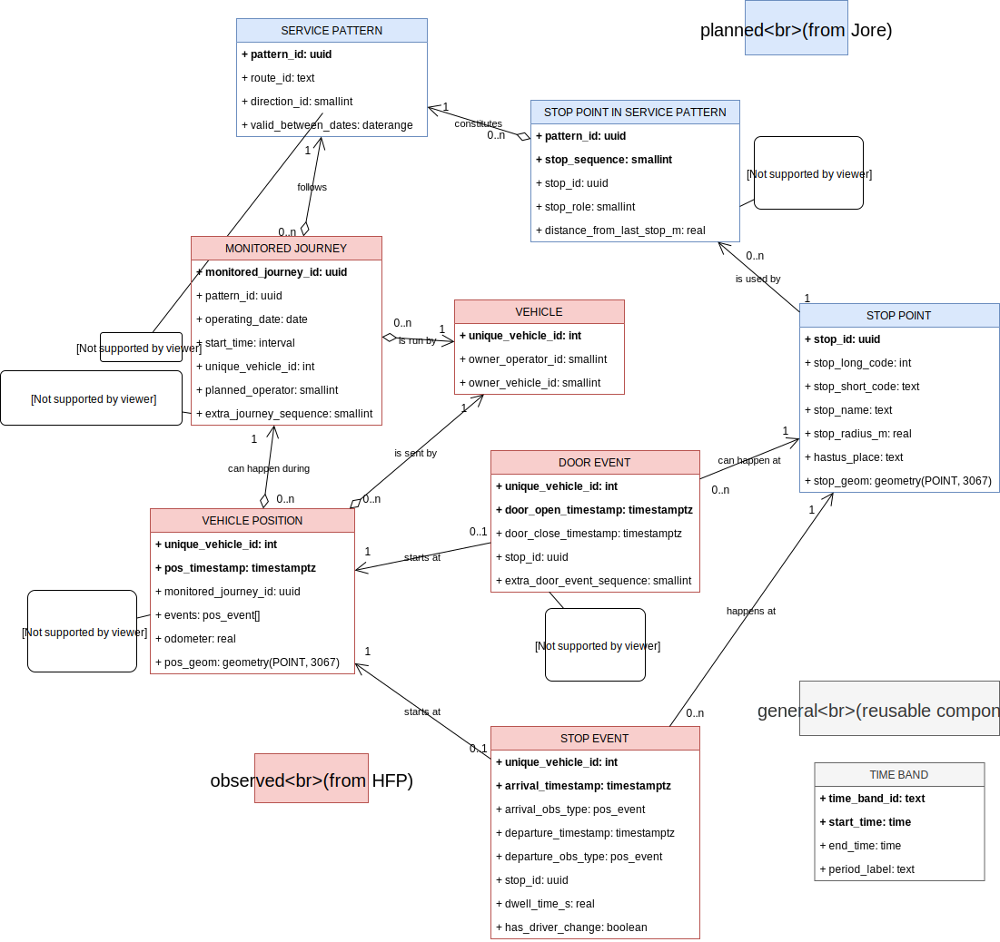

# Data model

# Main data

These schemas persist the core data.
Other schemas are meant for views, data I/O, and aggregated data.

Data in `planned` schema originates from Jore.
The schema models *planned* transit operations, the same data that was used by the vehicles when triggering stop events, for instance.

`observed` schema contains the observation data from HFP, about realized transit operations: vehicle locations, states, and possible events at each time.

`general` schema is meant for reusable components, such as parameters for analysis cases.
For instance, `general.time_band` contains start and end times for custom periods of day, such as `Morning rush`, `Midday`, and `Afternoon rush`.

# Imported data

`data_import` schema is used for importing raw data to the database and transforming it to the target tables in main data schemas.

It is possible to handle the tasks of this schema with a module outside the database in the future, if required.